# shri-2020-dev-tools

## Вкладка Network

### Дублирование ресурсов

Дубликаты:
  - https://lifehacker.ru/wp-content/uploads/2020/03/cover-2_1583398138.jpg
  - https://lifehacker.ru/wp-content/uploads/2020/03/cover-2_1583398138-630x315.jpg
  - https://lifehacker.ru/wp-content/uploads/2020/03/oblozhka-2_1584027252-630x315.jpg
  - https://lifehacker.ru/wp-content/uploads/2020/03/oblozhka-2_1584027252.jpg

Повторные запросы к одному ресурсу:
  - https://pagead2.googlesyndication.com/pagead/js/adsbygoogle.js

  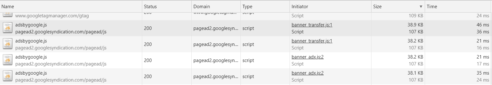

### Лишний размер ресурса

Использование изображений размером 2500x1250 без сжатия для элементов страницы с размерами 400x200:
  - https://lifehacker.ru/wp-content/uploads/2020/03/cover-2_1583398138.jpg (2.6 MB)
  - https://lifehacker.ru/wp-content/uploads/2020/02/oblozhka-sajt_1582038972.png (1.2 MB)
  - https://lifehacker.ru/wp-content/uploads/2020/03/oblozhka-2_1584027252.jpg
  - https://lifehacker.ru/wp-content/uploads/2020/02/1-3_1582816576.jpg

Не используется сжатие для SVG (ресурс содержит мета информацию и комментарии инструмента Sketch/ Adobe Illustrator)
  - https://lifehacker.ru/wp-content/themes/lifehacker/static/img/logo.svg

  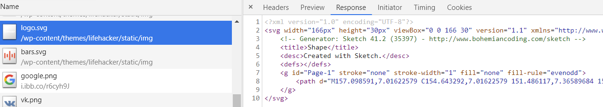

  - https://lifehacker.ru/wp-content/plugins/lh-push/frontend/dist/baseline-notifications-24px.svg?8189e042e1c0fd91daedb8b9942abf50

Нет сжатия css:
  - https://lifehacker.ru/wp-content/plugins/lh-profile/frontend/dist/app.css?ver=0.2.0
  - https://lifehacker.ru/wp-content/plugins/lh-appbox/css/styles.min.css?ver=17
  - https://lifehacker.ru/wp-content/plugins/lh-talker/widget/frontend/static/styles.css?ver=6.2.0
  - https://lifehacker.ru/wp-content/plugins/lh-spoilers/inc/bbspoiler.css?ver=5.1.4
  - https://lifehacker.ru/wp-content/plugins/lh-widgets/css/widgets.css?ver=66
  - https://lifehacker.ru/wp-content/plugins/responsive-lightbox/assets/nivo/themes/default/default.css?ver=1.7.2
  - https://lifehacker.ru/wp-content/themes/lifehacker/static/fonts/style.css?ver=1.6.0
  - https://cdn-images.mailchimp.com/embedcode/classic-10_7.css?ver=1.6.0
  - https://lifehacker.ru/wp-content/plugins/lh-deal/assets/public/outer.css?ver=45
  - https://lifehacker.ru/wp-content/plugins/lh-twister/assets/style.css?ver=7
  - https://lifehacker.ru/wp-content/plugins/lh-mumigrate/static/public/css/main.css?ver=5.1.4
  - https://lifehacker.ru/wp-content/themes/lifehacker/inc/classes/LhAbTitleSplitTesting/static/homepage.css?ver=7

Нет сжатия js:
  - https://lifehacker.ru/wp-content/themes/lifehacker/static/js/vendors.min.js?ver=1.6.0
  - https://lifehacker.ru/wp-content/plugins/responsive-lightbox/js/front.js?ver=1.7.2
  - https://lifehacker.ru/wp-content/plugins/lh-twister/assets/app.js?ver=7
  - https://lifehacker.ru/wp-content/plugins/lh-deal/assets/public/outer.js?ver=45
  - https://lifehacker.ru/wp-content/themes/lifehacker/static/js/adfox.asyn.code.ver3.js?ver=3.0
  - https://lifehacker.ru/wp-content/themes/lifehacker/inc/classes/LhAbTitleSplitTesting/static/homepage.js?ver=7
  - https://lifehacker.ru/wp-content/plugins/lh-appbox/js/app.js?ver=17
  - https://lifehacker.ru/wp-content/plugins/lh-views//static/js/get-views-count.js?ver=2.1.0

Повторное подключение набора шрифтов:
  - https://fonts.googleapis.com/css?family=Roboto%3A300%2C400%2C700
  - https://fonts.googleapis.com/css?family=Roboto+Condensed:400,700|Roboto:300,300i,400,400i,500,500i,700,900&subset=cyrillic

### Медленно загружающиеся ресурсы

Шрифты:
  - https://fonts.googleapis.com/css?family=Roboto+Condensed:400,700|Roboto:300,300i,400,400i,500,500i,700,900&subset=cyrillic
  - https://maxcdn.bootstrapcdn.com/font-awesome/4.7.0/css/font-awesome.min.css

Изображения:

  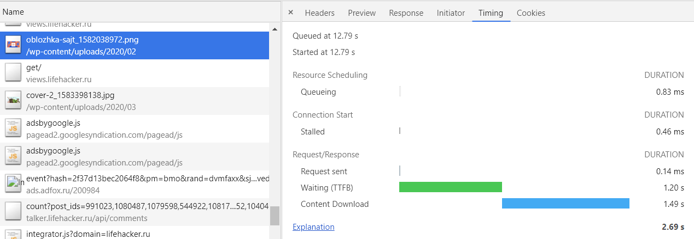
  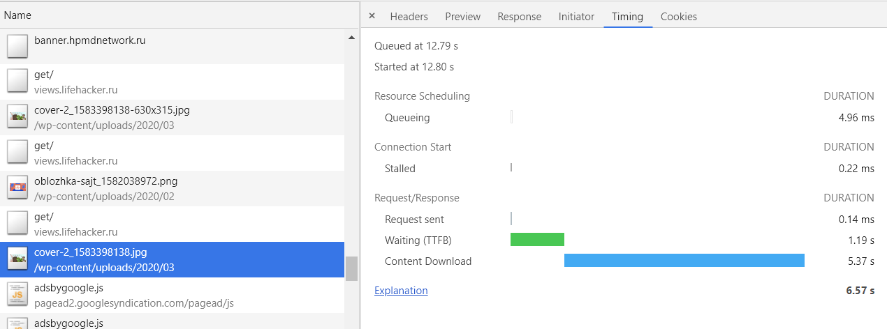

### Ресурсы, блокирующие загрузку

  - https://fonts.googleapis.com/css?family=Roboto+Condensed:400,700|Roboto:300,300i,400,400i,500,500i,700,900&subset=cyrillic
  - https://maxcdn.bootstrapcdn.com/font-awesome/4.7.0/css/font-awesome.min.css
  - https://lifehacker.ru/wp-content/plugins/lh-appbox/css/styles.min.css?ver=17
  - https://lifehacker.ru/wp-content/themes/lifehacker/static/styles/vendors.min.css?ver=1.6.0
  - https://lifehacker.ru/wp-content/themes/lifehacker/static/styles/all.min.css?ver=1.6.0

### Что-то ещё

Дублирование js библиотек:
  - https://lifehacker.ru/wp-content/plugins/lh-profile/frontend/dist/chunk-vendors.js?ver=0.2.0 включает JavaScript Cookie v2.2.1:

  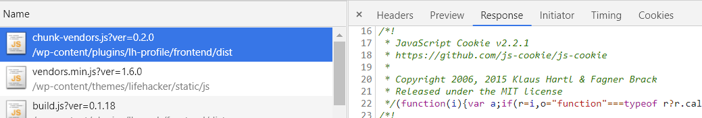

  - https://lifehacker.ru/wp-content/themes/lifehacker/static/js/vendors.min.js?ver=1.6.0 включает JavaScript Cookie v2.1.3:

  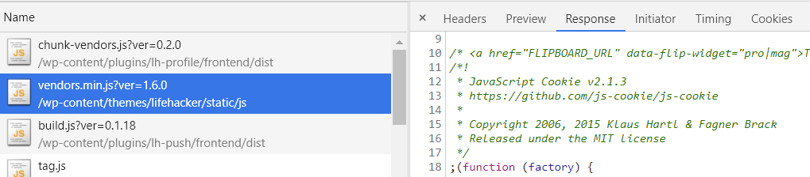

Наличие map файлов к js файлам (можно ознакомиться с исходным кодом), например:
  - https://lifehacker.ru/wp-content/plugins/lh-push/frontend/dist/build.js.map?ver=0.1.18
  - https://lifehacker.ru/wp-content/themes/lifehacker/static/styles/all.min.css.map?ver=1.6.0

На странице так-же содержатся блоки  и  с неcжатым кодом:

  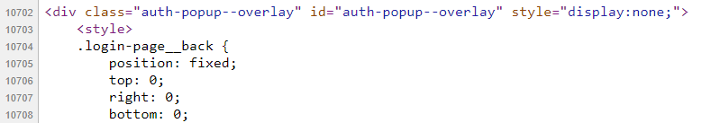
  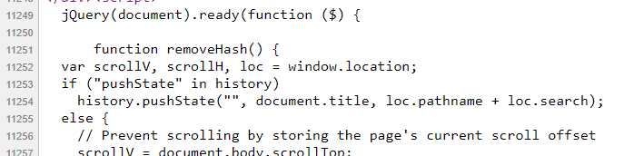

## Вкладка Performance

Измерить время в миллисекундах от начала навигации до событий:
  - First Paint: 2804.6 мс
  - First Meaningful Paint: 2804.6 мс
  - DOM Content Loaded: 3882.0 мс
  - Load: 9743.3 мс

Измерить, сколько времени в миллисекундах тратится на разные этапы обработки документа:
 - Loading: 82 мс
 - Scripting: 1885 мс
 - Rendering: 597 мс
 - Painting: 109 мс

 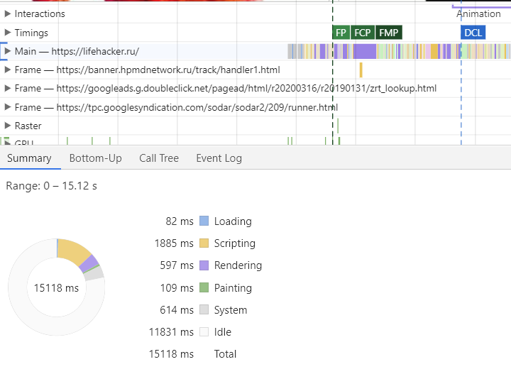

## Вкладка Coverage

Сохранить скриншот вкладки после загрузки страницы:

 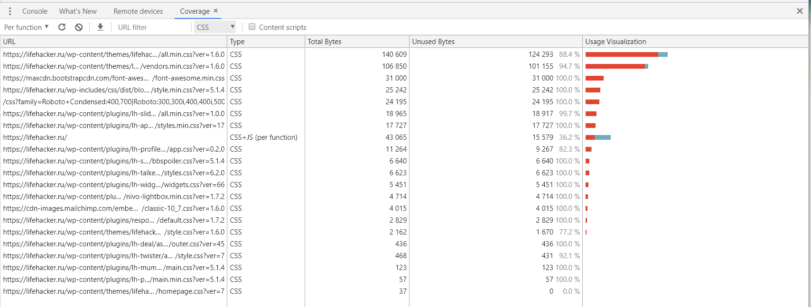
 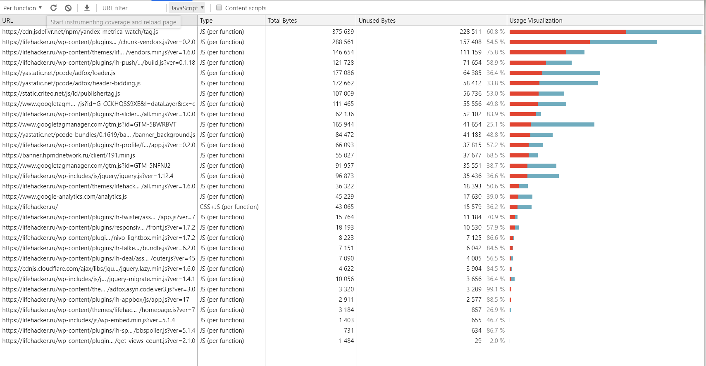

Объём неиспользованного CSS в ходе загрузки страницы: 400.36 КБ

Объём неиспользованного JS в ходе загрузки страницы: 1191.328 КБ
